# 프로젝트명 : RollingRock(송하민)

# [ 목차 ]

## 1. [개요](#개요)
  - 게임명
  - 참여 인원 및 역할

## 2. [컨셉](#컨셉)
  - 메인 컨셉
  - 서브 컨셉

## 3. [관련 이미지 & 동영상](#이미지동영상)

## 4. [대표 이미지](#대표이미지)

## 5. [컨셉 & 대표이미지 기반 작품묘사](#작품묘사)
  - 대표이미지 기반
  - 컨셉 기반

## 6. [RollingRock : 구성 요소](#구성요소)
  - 메커니즘
  - 이야기
  - 미적요소
  - 기술

## 7. [게임 시스템 디자인](#게임시스템디자인)
  - 게임 오브젝트 분해 (구성 요소 분석)
  - 파라미터(속성) 뽑아 보기
  - 행동 뽑아 보기
  - 상태 뽑아 보기
  - 플레이어 캐릭터 속성(파라미터)
  - 게임의 규칙
  - 게임에서 사용될 공식

## 8. [FlowChart](#FlowChart)
  - 순서도
  - 키 이벤트

## 9.[요구사항]6주치(#6주치)

## 10.[요구사항]1년치(#1년치)

## 11. [스토리보드](#스토리보드)

  

# [개요] 

> ## 게임명

### RollingRock

- 바위가 되어 건축물의 재료로 갇혀버린 바위들을 인간들로부터 해방시킨다.

 

> ## 참여 인원 및 역할

|이름|역할|
|:---:|:---:|
|송하민|게임 기획 및 프로그래밍|
|정영범|게임 오브젝트 모델링 및 텍스쳐링, 레벨 및 맵 디자인|

  

# [컨셉] 

> ## 메인 컨셉

### 파괴

- 최종 목표인 성문이나 스테이지 내의 장애물들을 부수는 것으로 희열감을 얻을 수 있다.

> ## 서브 컨셉

### 장애물

- 스피드만 빠르게 되면 자칫 루즈해질 수 있는 게임에 장애물이라는 긴장감을 주어 플레이어로 하여금 높은 몰입감을 주기 위해 장애물을 넣는다.

### 성장

- 스테이지 내에서 재화를 획득하여 플레이어의 캐릭터가 점차 성장해 가는 시스템을 주어 스테이지가 처음에는 난이도가 높아 클리어가 어려울 지라도 점차 성장함에 따라 난이도가 점진적으로 하향되어 난이도에 대한 제약을 덜 받게 할 수 있다.

### 전략

- 본인의 컨트롤에 따른 성장 테크트리를 구축하여 스테이지에와 본인의 실력에 따라 원하는 전략을 구상할 수 있어 플레이어 캐릭터에 더욱 몰입할 수 있는 요소를 준다.

### 스피드

- 빠른 스피드를 통해 플레이어로 하여금 몰입감과 쾌감을 선사한다.

### 스테이지의 연속성

- 스테이지를 클리어하거나 리셋하기 전까지는 한 스테이지 내에서 플레이어가 플레이한 내용이 다음 플레이에도 영향을 주는 연속성을 주어 다양한 전략을 낼 수 있도록 유도한다.

  

# [관련 이미지 & 동영상] 

- ## 이미지  

  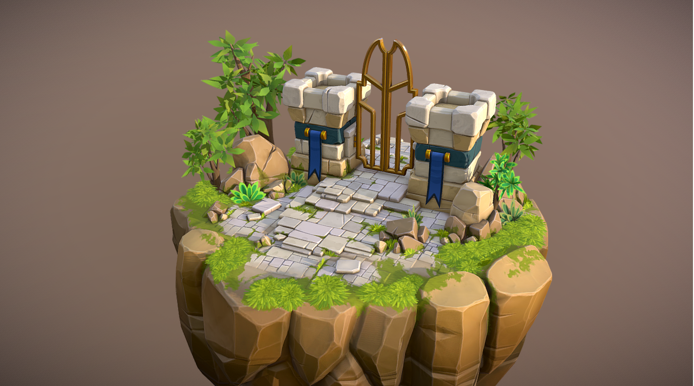
  
   
  
- ## 동영상

  [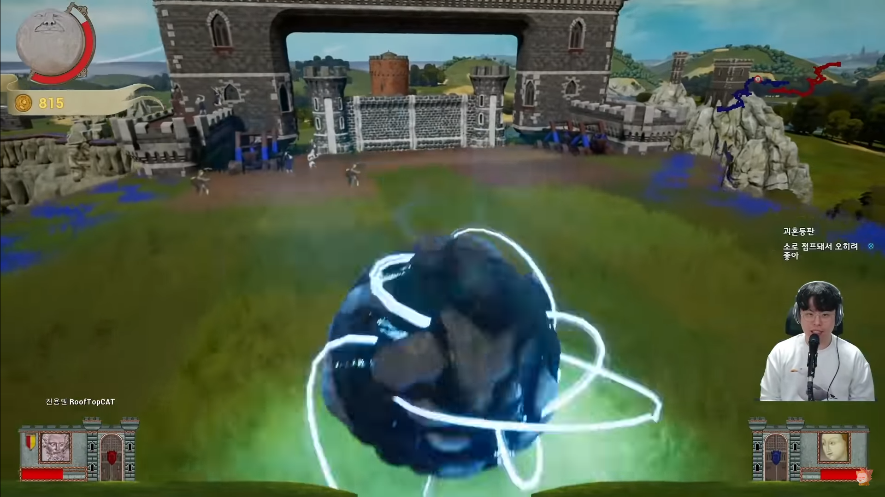](https://www.youtube.com/watch?v=uZyJKFHiTP4)

  

# [대표 이미지] 

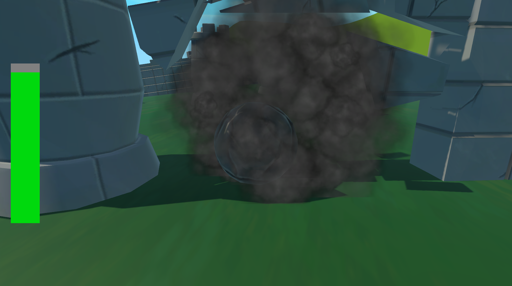

  

# [컨셉 & 대표이미지 기반 작품묘사] 

> ## 대표이미지 기반

- 좌측 하단의 조이패드를 이용하여 플레이어가 바위를 조종할수있도록 합니다.

- 좌측 중단에 플레이어의 체력바를 배치하여 외부로부터의 충격을 받으면 플레이어의 체력이 줄어들고 체력이 0 이 될시 플레이어가 파괴 됩니다.

- 좌측 상단에 상점 아이콘을 배치하여 플레이어가 장애물을 파괴하여 얻은 포인트를 소모하여 플레이어의 바위를 강화 할수있습니다.

- 중앙 상단에 성의 체력바를 배치하여 언제든지 플레이어가 성의 체력을 확인할수있도록 하였습니다.

- 우측 상단에 환경설정을 배치하여 사운드 및 나가기등의 설정을 제공합니다

 

> ## 컨셉 기반

- 플레이어가 바위가 되어 자연의 다른 바위들이 인간에 의해 강제적으로 건축물이 된것을 해방하는것을 목표로 합니다.

  

# [RollingRock : 구성 요소] 

> ## 메커니즘

### [도전 과제]

- 적의 구조물을 파괴하여 성장하라
- 적의 성벽에 도달해 적을 없애라

### [재미 요소]

- 플레이어가 바위가 되어 굴러간다는 색다른 경험
- 여러 구조물들을 파괴하며 파괴의 희열감을 줌
- 구조물을 파괴해가며 성장하는 플레이어

  

> ## 이야기

### [만들게 된 배경]  

- 바위가 구조물들을 파괴해가면서 적을 없애는 게임의 모습이 흥미로워 제작을 진행하게 되었다
- 사용자가 모바일기기를 통해 언제 어디서든 바위로 구조물을 파괴하며 스트레스해소를 하면 좋을 것 같아 제작을 하게 되었다

### [카메라 관점]  

- 플레이어의 뒤에서 카메라가 따라다니며 플레이어가 좌측이나 우측으로 이동을 하면 카메라가 같이 회전한다.

  

> ## 미적요소

### [디자인]

- 배경: 바위 산 밑에 마을이 있는 모습
- 플레이어: 산에 있는 바위, 잘 굴러 떨어지기 위해 동그란 모습
- 오브젝트: 각종 석조 건축물들을 배치하여 플레이어의 이동을 제약하는 요소가 되지만 동시에
파괴하게 되면 플레이어가 성장하는 요소가 되는 플레이어에게 이점과 실점이 공존

### [음향]  

- 플레이어 이동 시 굴러가는 음향
- 오브젝트 파괴 시 파괴음
- 오브젝트와 충돌 시 충돌음
- 자연 컨셉에 맞는 배경음악

  

> ## 기술

 - 모바일 환경을 고려한 LOW POLYGON모델링 제작
 - 모바일 환경에 맞는 해상도 설정
 - 유니티의 물리엔진을 기반으로 게임 제작
 - 유니티의 URP를 활용하여 그래픽 향상
 - 유니티의 셰이더그래프를 활용하여 셰이더를 제작

   

# [게임 시스템 디자인] 

> ## 게임 오브젝트 분해 (구성 요소 분석)

|번호|오브젝트 이름(영문이름)|이미지|
|:---:|:---:|:---:|
|1|바위(Rock)/Player|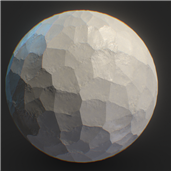|
|2|성문(Castle Gate)/승리조건|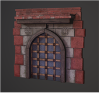|
|3|성벽(Rampart)|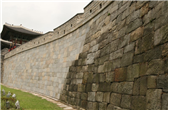|
|4|주민(Citizen)/적|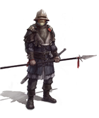   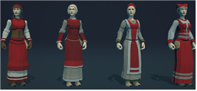 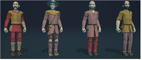|
|5|나무(Tree)|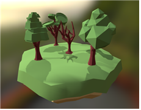|
|6|가시함정(Trap)|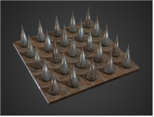|
|7|풍차(Windmill)|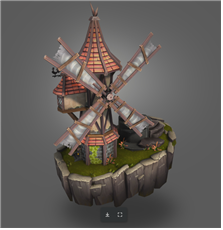|
|8|폭탄(Bomb)|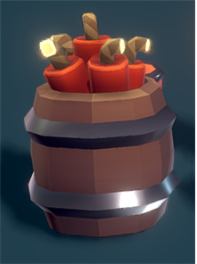|
|9|경사로(Slope)|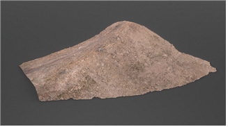|
|10|벙커(Bunker)|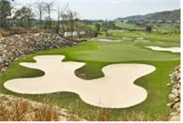|
|11|스테이지(Select Stage)|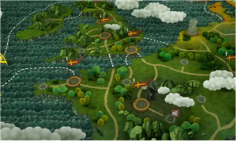|
|12|환경설정(Setting)||
|13|메뉴(Menu)|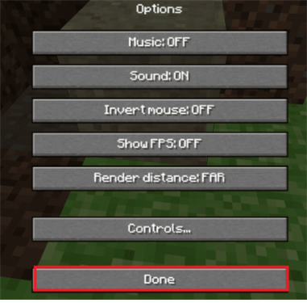|
|14|상점(Shop)|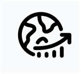|
|15|조이스틱(JoyStick)|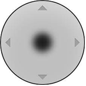|

  

> ## 파라미터(속성) 뽑아 보기

### 1. 오브젝트 이름 : 바위

|속성|영문 명칭|설명|
|:---:|:---:|:---:|
|질량|Mass|바위의 질량, 질량이 높을수록 성문에 큰 데미지를 주고 성벽을 더 잘 부숨|
|가속|Acceleration|가속력, 플레이어가 원하는 방향으로 속도를 변환시켜주는 정도|
|최대 속력|Max Speed|플레이어가 움직이는 속도를 제한하는 속도|
|지름|Diameter|플레이어의 scale, 플레이어의 크기 조절|
|체력|Health|플레이어의 내구도, 체력이 0이 되면 플레이어가 파괴됨|
|재화|Stone Point|플레이어가 성벽을 파괴하게 되면 해당 포인트를 얻고 포인트를 이용하여 플레이어를 강화할 수 있다|

 

### 2. 오브젝트 이름 : 성문

|속성|영문 명칭|설명|
|:---:|:---:|:---:|
|체력|Health|체력이 0이되면 플레이어의 승리|

 

### 3. 오브젝트 이름 : 성벽

|속성|영문 명칭|설명|
|:---:|:---:|:---:|
|체력|Health|체력이 0이되면 플레이어에게 재화를 준다|
|획득 재화량|Get Point|파괴되면 플레이어에게 재화를 준다|

 

### 4. 오브젝트 이름 : 주민

|속성|영문명칭|설명|
|:---:|:---:|:---:|
|무기|Weapon|플레이어에게 무기를 던져 플레이어의 접근을 막는다|
|이동|Move|이동한다|
|정지|Stop|가만히 있는다|

 

### 5. 오브젝트 이름 : 풍차

|속성|영문명칭|설명|
|:---:|:---:|:---:|
|바람세기|Power|바람의 세기를 조절한다|
|바람모드|Mode|범위 내에 들어온 오브젝트에 가하는 AddForce의 Mode를 설정한다|

 

### 6. 오브젝트 이름 : 폭탄

|속성|영문 명칭|설명|
|:---:|:---:|:---:|
|폭발세기|Power|폭탄이 터지면 얼마나 멀리 날아가는지 조절|
|폭발피해량|Damage|플레이어에게 데미지를 준다|

  

> ## 행동 뽑아 보기

### 1. 오브젝트 이름 : 바위

|행동|영문 명칭|설명|
|:---:|:---:|:---:|
|이동|Move|플레이어를 이동시킨다|
|점프|Jump|위로 튀어오른다|

 

### 2. 오브젝트 이름 : 주민

|행동|영문 명칭|설명|
|:---:|:---:|:---:|
|이동|Move|좌우로 이동한다|
|바위에 깔림|Crush|바위에 깔려 납작해진다|
|공격|Attack|바위를 공격한다|

  

> ## 상태 뽑아 보기

### 1. 오브젝트 이름 : 바위

|현상태|전이상태|전이조건|
|:---:|:---:|:---:|
|이동|점프|점프키를 누름|

 

### 2. 오브젝트 이름 : 주민

|현상태|전이상태|전이조건|
|:---:|:---:|:---:|
|이동|바위에 깔림|플레이어에게 부딪혀 깔린 상태|
|이동|공격|플레이어가 일정 범위 내에 들어오면 공격|

  

> ## 플레이어 캐릭터 속성(파라미터)

|속성|영문 명칭|설명|
|:---:|:---:|:---:|
|바위|Rock|기본적인 바위|
|황금|Gold|체력이 약하지만 더 많은 재화를 얻을 수 있다|
|철|Steel|기본 바위보다 체력이 높고 단단하다|
|다이아|Diamond|철, 바위보다 체력이 높고 단단하다|

  

> ## 게임의 규칙

### 핵심 규칙
1. 게임 시작 시 Fade In이 되고 바위의 모습이 보인다.
2. 플레이어는 바위를 조종하여 성벽 및 각종 구조물들을 부숴 포인트를 획득하거나 구조물들을 피해 성벽에 도달하여 성벽에 피해를 주면 한판이 끝나게 된다.
3. 획득한 스톤포인트를 이용하여 새로운 바위를 만들고 해당 바위를 이용하여 새로운 판을 시작한다.
4. 성벽을 파괴하거나 스톤포인트로 새로운 바위를 생성할 수 없게 되면 게임이 종료되고 해당 스테이지의 클리어 여부를 판별한다.
5. 스테이지를 클리어하면 다음 스테이지로 넘어갈 수 있게 된다.

 

### 보조 규칙
- 적의 구조물 파괴 시 스톤포인트 획득

  

> ## 게임에서 사용될 공식

### 플레이어, 구조물 충돌 공식
1. 플레이어와 구조물이 부딪히면 플레이어의 magnitude를 계산한다.
2. 플레이어의 충돌력이 구조물의 체력을 넘는다면 구조물을 파괴한다.

 

### 플레이어, 성벽 충돌 공식
1. 플레이어와 성벽이 부딪히면 플레이어의 magnitude를 계산한다.
2. 플레이어의 충돌력만큼 성벽의 체력에 데미지를 준다.

  

# [FlowChat]

## 순서도

 

## 키 이벤트

  

# [요구사항(6주)] 
> ## 프로그래밍

### 플레이어 및 게임시스템
- 게임 시작 및 한판이 끝날 때 fade in/out 효과
- ~~플레이어가 바위를 움직임~~
- 점프 버튼을 누르면 바위가 뛰어오름
- 바위가 지면에 닿지 않는다면 1/10의 속도로 움직임
- ~~카메라가 플레이어의 뒤에서 플레이어를 따라다니며 플레이어를 보여줌~~
- 상점에서 플레이어 캐릭터 선택 시 재화를 사용하여 구매
- 플레이어의 HP가 0일때 구매 재화가 부족하면 게임 실패
- 플레이어가 적의 성문을 부수면 게임 클리어
- 벽을 투과하여 보여지게 하는 셰이더 제작
- 적의 구조물을 파괴한다면 파괴하면서 지나가며 파괴하지 못하면 막힘

### 적 유닛 및 구조물
- 적의 구조물 파괴 시 재화획득
- 적의 구조물 파괴 시 구조물 조각내기
- 파괴된 구조물 조각 일정시간 뒤에 사라지게 하기

### UI
- 게임 승리/패배 시 조건에 맞는 게임화면 출력
- 게임 타이틀 화면 제작
- 상점UI제작
- 스테이지 화면 제작
- 설정창 제작
- 메뉴창 제작

### 모바일 전환

 

> ## 디자인
### 모델링 제작
- 바위/플레이어
- 성벽
- 성문
- 주민/적
- 나무
- 가시함정
- 풍차
- 폭탄
- 맵

### 기본 텍스쳐 제작
- 바위/플레이어
- 성벽
- 성문
- 주민/적
- 나무
- 가시함정
- 풍차
- 폭탄
- 맵

### 모델링 바리에이션 제작
- 스테이지 컨셉에 따른 텍스쳐 바리에이션
- 건물 의 세부 장식 제작

### 스테이지 제작 및 레벨링

# [요구사항(1년치)] 
> ## 프로그래밍

### 플레이어 및 게임시스템
- 게임 시작 및 한판이 끝날 때 fade in/out 효과
- 플레이어가 바위를 움직임
- 점프 버튼을 누르면 바위가 뛰어오름
- 바위가 지면에 닿지 않는다면 1/10의 속도로 움직임
- 카메라가 플레이어의 뒤에서 플레이어를 따라다니며 플레이어를 보여줌
- 상점에서 플레이어 캐릭터 선택 시 재화를 사용하여 구매
- 플레이어의 HP가 0일때 구매 재화가 부족하면 게임 실패
- 플레이어가 적의 성문을 부수면 게임 클리어
- 벽을 투과하여 보여지게 하는 셰이더 제작
- 적의 구조물을 파괴한다면 파괴하면서 지나가며 파괴하지 못하면 막힘

### 적 유닛 및 구조물
- 적의 구조물 파괴 시 재화획득
- 적의 구조물 파괴 시 구조물 조각내기
- 파괴된 구조물 조각 일정시간 뒤에 사라지게 하기
- 적 유닛 제작
- 적 공격 및 AI 제작

### UI
- 게임 승리/패배 시 조건에 맞는 게임화면 출력
- 게임 타이틀 화면 제작
- 상점UI제작
- 스테이지 화면 제작
- 설정창 제작
- 메뉴창 제작

### 모바일 전환

 

> ## 디자인

### 모델링 제작
- 바위/플레이어
- 성벽
- 성문
- 주민/적
- 나무
- 가시함정
- 풍차
- 폭탄
- 맵

### 텍스쳐 제작
- 바위/플레이어
- 성벽
- 성문
- 주민/적
- 나무
- 가시함정
- 풍차
- 폭탄
- 맵

### 모델링 바리에이션 제작
- 스테이지 컨셉에 따른 텍스쳐 바리에이션
- 건물 의 세부 장식 제작

### 스테이지 제작 및 레벨링

### UI 제작
 - 메인 메뉴 버튼
 - 상점 버튼 이미지
 - 조이스틱
 - 환경설정 이미지
 - 타이틀 화면
 - 스테이지 선택 화면
 - 승리/패배 화면
 - 포인트 이미지
 - 드래그 바

  

# 스토리보드
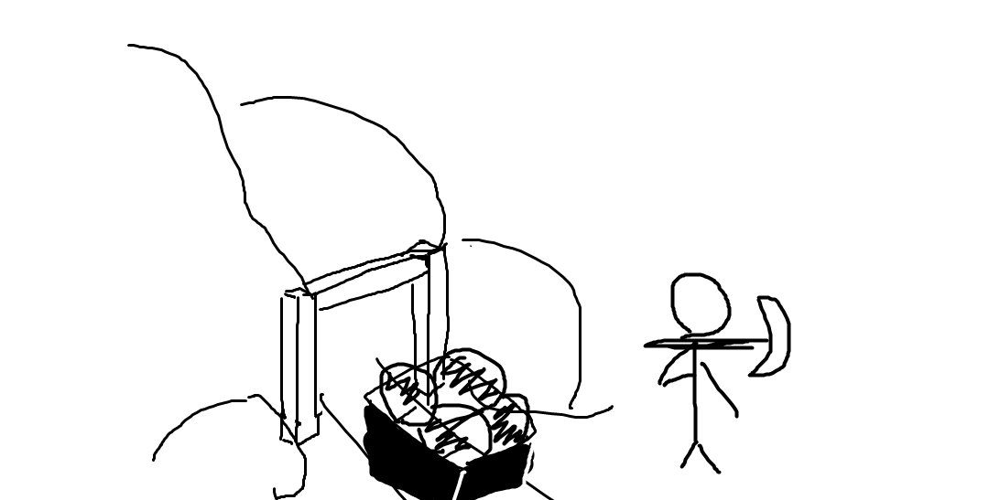
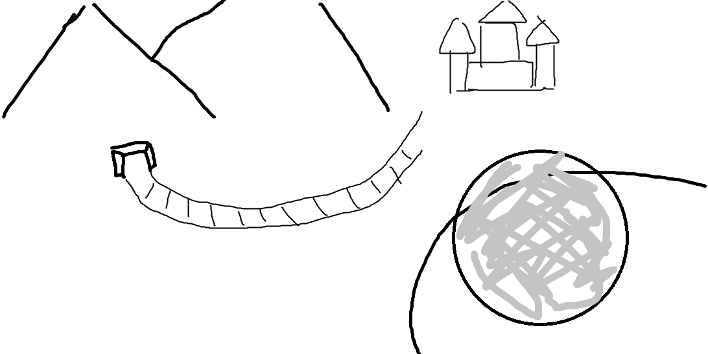
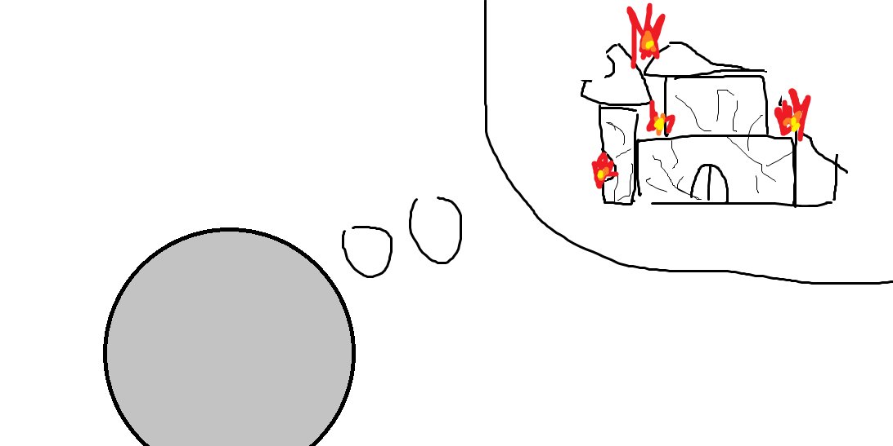
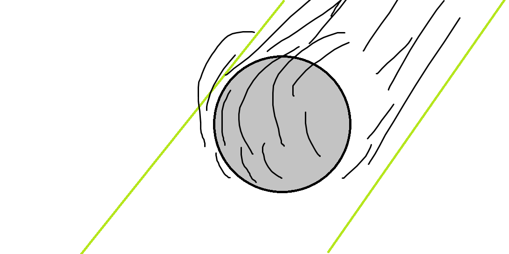
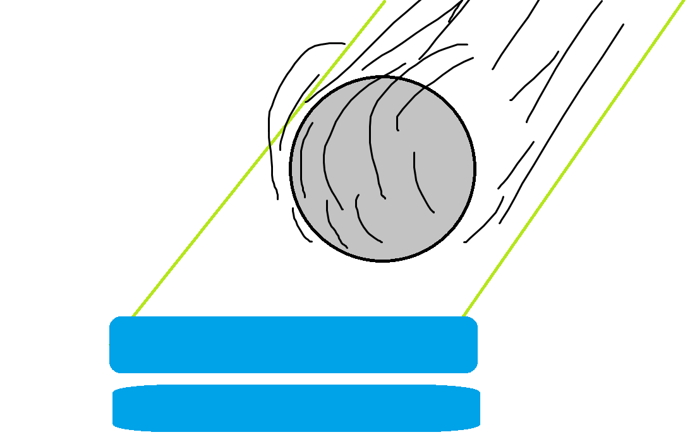
