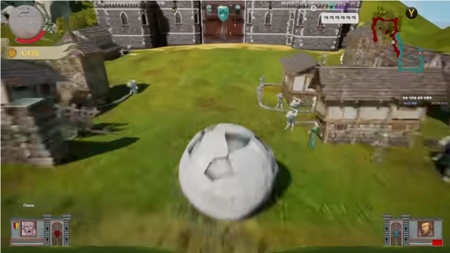
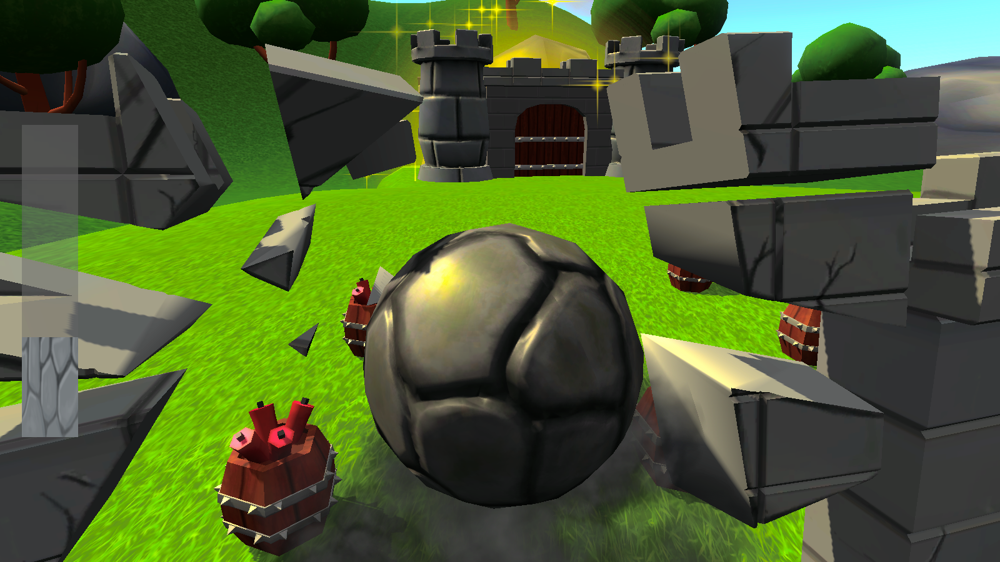
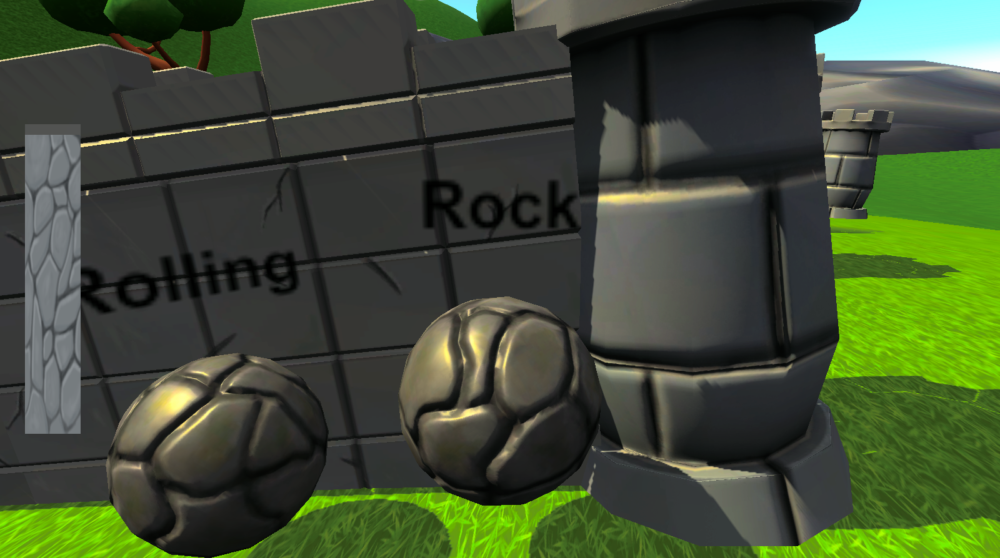
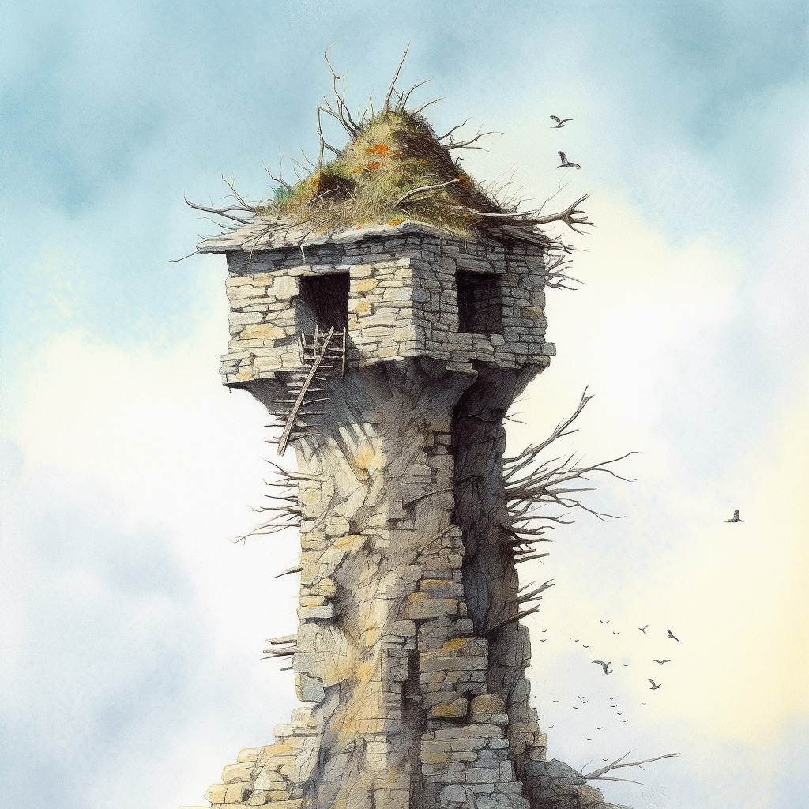
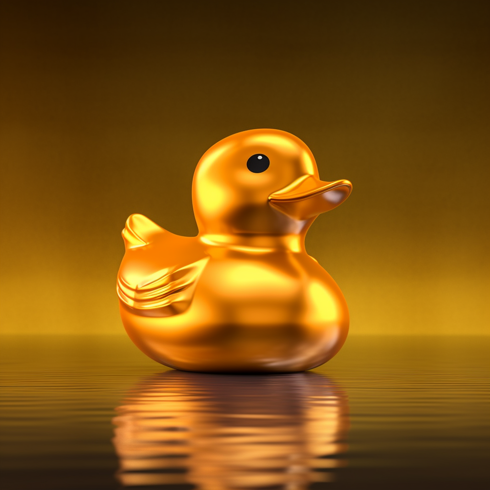

# 프로젝트명 : RollingRock(송하민)

# [ 목차 ]

## 1. [개요](#개요)
  - 게임명
  - 참여 인원 및 역할

## 2. [컨셉](#컨셉)
  - 메인 컨셉
  - 서브 컨셉

## 3. [관련 이미지 & 동영상](#이미지동영상)

## 4. [대표 이미지](#대표이미지)

## 5. [컨셉 & 대표이미지 기반 작품묘사](#작품묘사)
  - 대표이미지 기반
  - 컨셉 기반

## 6. [RollingRock : 구성 요소](#구성요소)
  - 메커니즘
  - 이야기
  - 미적요소
  - 기술

## 7. [게임 시스템 디자인](#게임시스템디자인)
  - 게임 오브젝트 분해 (구성 요소 분석)
  - 파라미터(속성) 뽑아 보기
  - 게임의 규칙
  - 게임에서 사용될 공식
  
## 8.[요구사항](#요구사항)

  

# [개요] 

> ## 게임명

### RollingRock

- 바위가 되어 황금을 모아 부자가 된다

 

> ## 참여 인원 및 역할

|이름|역할|
|:---:|:---:|
|송하민|게임 기획 및 프로그래밍|
|정영범|게임 오브젝트 모델링 및 텍스쳐링, 레벨 및 맵 디자인|

  

# [컨셉] 

> ## 메인 컨셉

### 파괴

- 최종 목표인 성문이나 스테이지 내의 장애물들을 부수는 것으로 희열감을 얻을 수 있다.

> ## 서브 컨셉

### 장애물

- 스피드만 빠르게 되면 자칫 루즈해질 수 있는 게임에 장애물이라는 긴장감을 주어 플레이어로 하여금 높은 몰입감을 주기 위해 장애물을 넣는다.

### 컨트롤

- 어려운 조작 난이도를 통해 컨트롤을 세심하게 할 수 있게 한다.

### 전략

- 스테이지를 다회차 플레이하여 어떤 오브젝트를 파괴하면서 진행할지 전략을 설정할 수 있게 한다.

### 스피드

- 고저차를 통한 빠른 스피드를 통해 플레이어가 감당할 수 없는 스피드를 선사한다.

### 스테이지의 연속성

- 스테이지를 클리어하거나 리셋하기 전까지는 한 스테이지 내에서 플레이어가 플레이한 내용이 다음 플레이에도 영향을 주는 연속성을 주어 다양한 전략을 낼 수 있도록 유도한다.

  

# [관련 이미지 & 동영상] 

- ## 이미지  

  
  
   
  
- ## 동영상

  

  

# [대표 이미지] 

  

# [컨셉 & 대표이미지 기반 작품묘사] 

> ## 대표이미지 기반

- 키보드의 wasd를 통해 플레이어 조작

- 화면 좌측에 위치한 플레이어의 Hp가 0이 되거나 밖으로 떨어질 시 플레이어 사망

- 성에 도달하여 성문파괴 후 황금 새를 획득 시 스테이지 클리어

 

> ## 컨셉 기반

- 플레이어가 바위가 되어 황금새를 모아 부자가 되는 것을 목표로 한다

  

# [RollingRock : 구성 요소] 

> ## 메커니즘

### [도전 과제]

- 각 스테이지에 숨겨져 있는 황금 새를 모은다
- 적의 성벽에 도달하여 적의 성문을 파괴 후 그 안에 들어있는 황금을 얻는다

### [재미 요소]

- 여러 구조물들을 파괴하는 파괴의 희열감
- 어려운 조작 난이도를 통한 컨트롤의 재미
- 멀티플레이를 통한 경쟁

  

> ## 이야기

### [만들게 된 배경]  

- 직접 바위가 되어 각종 구조물들을 파괴하는 모습에 흥미를 느낌
- 해당게임에 플랫폼 방식을 결합하면 더욱 재미있을 것으로 생각함

### [카메라 관점]  

- 플레이어를 따라다니며 3인칭으로 플레이어를 비춤
- 마우스로 카메라를 움직이면 플레이어 주위를 회전함

  

> ## 미적요소

### [디자인]

- 배경: 바위 산 밑에 마을이 있는 모습
- 플레이어: 산에 있는 바위, 잘 굴러 떨어지기 위해 동그란 모습
- 오브젝트: 각종 석조 건축물들을 배치하여 플레이어의 이동을 제약하는 요소

### [음향]  

- 플레이어 이동 시 굴러가는 음향
- 오브젝트 파괴 시 파괴음
- 오브젝트와 충돌 시 충돌음
- 폭탄 폭파 시 폭팔음
- 바람을 내보내는 소리
- 오리가 부딪히는 소리

  

> ## 기술

 - 유니티의 물리엔진을 기반으로 게임 제작
 - 프로그래밍 언어 C#의 Marshalling을 통한 네트워크 통신

   

# [게임 시스템 디자인] 

> ## 게임 오브젝트 분해 (구성 요소 분석)

|번호|오브젝트 이름(영문이름)|이미지|
|:---:|:---:|:---:|
|1|바위(Rock)/Player||
|2|성문(Castle Gate)||
|3|성벽(Rampart)||
|5|나무(Tree)||
|6|가시함정(Trap)||
|7|풍차(Windmill)||
|8|새집(Bird House)||
|9|폭탄(Bomb)||
|11|경사로(Slope)||
|12|스테이지(Select Stage)||
|13|환경설정(Setting)||
|14|메뉴(Menu)||
|15|황금 새(Gold Bird)||

  

> ## 게임의 규칙

### 핵심 규칙
1. 구조물을 파괴하며 앞으로 나아감
2. 성문 파괴 후 큰 황금 새를 획득 시 스테이지 클리어
3. 스테이지 클리어 화면 출력

 

### 보조 규칙
1. 구조물 파괴 시 스테이지 초기화 전까지 파괴된 상태
2. 작은 황금 새를 모아 별을 채움

  

> ## 게임에서 사용될 공식

### 플레이어, 구조물 충돌 공식
1. 플레이어, 구조물 충돌 시 플레이어의 velocity와 구조물이 충격을 직접적으로 받는 Normal벡터를 Dot Product하여 충격량 계산
2. 계산된 충격량을 통해 구조물의 HP 감소 후 0이하가 되면 구조물 파괴
3. 해당 충격량이 플레이어에게도 전달

 

### 폭발물의 폭발력, 데미지 공식
1. 폭발물에 접촉 시 폭파
2. 폭발물 주변 폭발 범위에 플레이어, 성벽과 같은 구조물이 있다면 폭발물-오브젝트 거리를 폭발물의 최대 폭발 거리를 나눔
3. 계산된 결과를 폭발력, 데미지에 곱하여 해당 폭발력과 데미지를 주변에 전달

 

### 풍차 공식
1. 풍차로부터 오브젝트가 떨어진 거리 계산
2. 떨어진 거리를 풍차의 영향력이 닿는 최대 거리로 나눔
3. 계산된 결과를 풍차의 바람힘에 곱하여 전달

 

### 새 집 공식
1. 새 집으로 부터 플레이어 까지의 거리 계산
2. 일정 거리 내부로 들어오면 미리 설정된 bullet을 플레이어를 발견한 위치로 발사

  

# [요구사항] 
> ## 프로그래밍

### 게임시스템
- ~~fade in/out 효과~~
- ~~플레이어가 적의 성문을 부수면 게임 클리어~~
- ~~적의 구조물을 파괴한다면 파괴하면서 지나가며 파괴하지 못하면 막힘~~
- ~~플레이어의 HP가 0이 되면 초기위치로 돌아감~~
- ~~플레이어가 스테이지 이탈 시 초기위치로 돌아감~~
- ~~스테이지 클리어시 해금~~
- ~~스테이지 해금 사항 저장~~

### 플레이어
- ~~wasd를 눌러서 바위를 움직임~~
- ~~점프 버튼을 누르면 바위가 뛰어오름~~
- ~~카메라가 플레이어의 뒤에서 플레이어를 따라다니며 플레이어를 보여줌~~
- ~~마우스의 움직임으로 카메라를 제어할 수 있음~~

### 오브젝트
- ~~적의 구조물 접촉 시 HP를 감소시키고 HP가 일정량 떨어지면 오브젝트에 금이 감~~
- ~~적의 구조물의 HP가 0이하로 떨어지면 구조물 파괴~~
- ~~파괴된 구조물 조각 사라지게 하기~~
- ~~폭탄 접촉 시 폭탄 파괴 및 폭발 생성~~
- ~~폭발 주변에 폭탄 존재 시 연쇄폭발, 오브젝트 존재 시 오브젝트에 데미지를 줌~~
- ~~구조물 파괴 시 파괴 효과 생성~~
- ~~풍차의 바람영역에 있으면 바람에 밀림~~
- ~~가시함정 접촉 시 플레이어 데미지 입음~~
- ~~새집을 통해 새를 발사하거나 폭탄을 플레이어를 향해 날림~~
- ~~성문 안에 있는 황금 새 획득 시 게임 클리어~~
- ~~성문 밖에 있는 황금 새 획득 시 스테이지 별 추가~~

### UI
- ~~스테이지 클리어 출력~~
- ~~게임 타이틀 화면 제작~~
- ~~설정창 제작~~
- ~~사운드, 마우스 민감도 설정 및 저장~~
- ~~스테이지 선택~~
- ~~플레이어 HP 표출~~

### 네트워크
- ~~서버/클라이언트 제작~~
- ~~TCP서버 연결~~
- ~~UDP서버 연결~~
- ~~준비창 제작~~
- ~~준비상태 출력~~
- ~~게임 시작~~
- ~~각 플레이어의 위치, 회전값 동기화~~
- ~~클라이언트 위치, 회전값 보간~~
- ~~플레이어 이동 동기화~~
- ~~플레이어 점프 동기화~~
- ~~구조물 파괴 동기화~~
- ~~폭탄 폭파 동기화~~
- ~~풍차 바람영향 동기화~~
- ~~새 집 날리는 새 동기화~~
- ~~각 플레이어 체력 동기화~~
- ~~각 플레이어 사망 상태 동기화~~
- ~~플레이어 승리 시 승리화면 출력~~

 

> ## 디자인

### 모델링 제작
- ~~폭탄~~
- ~~성벽~~
- ~~성채~~
- ~~성문~~
- ~~주민/적~~
- ~~나무~~
- ~~가시함정~~
- ~~풍차~~
- ~~새집~~
- ~~바위/플레이어~~
- ~~맵~~
- ~~스타트 라인~~

### 텍스쳐 제작
- ~~폭탄~~
- ~~성벽~~
- ~~성채~~
- ~~성문~~
- ~~주민/적~~
- ~~나무~~
- ~~가시함정~~
- ~~풍차~~
- ~~새집~~
- ~~바위/플레이어~~
- ~~맵~~
- ~~스타트 라인~~
- ~~성벽 데미지 입은 모습 1,2~~
- 

### 모델링 바리에이션 제작
- ~~성벽~~
- ~~성채~~

### 스테이지 제작 및 레벨링
- ~~스테이지 1 제작 및 오브젝트 배치~~
- ~~스테이지 2 제작 및 오브젝트 배치~~
- ~~스테이지 3 제작 및 오브젝트 배치~~
