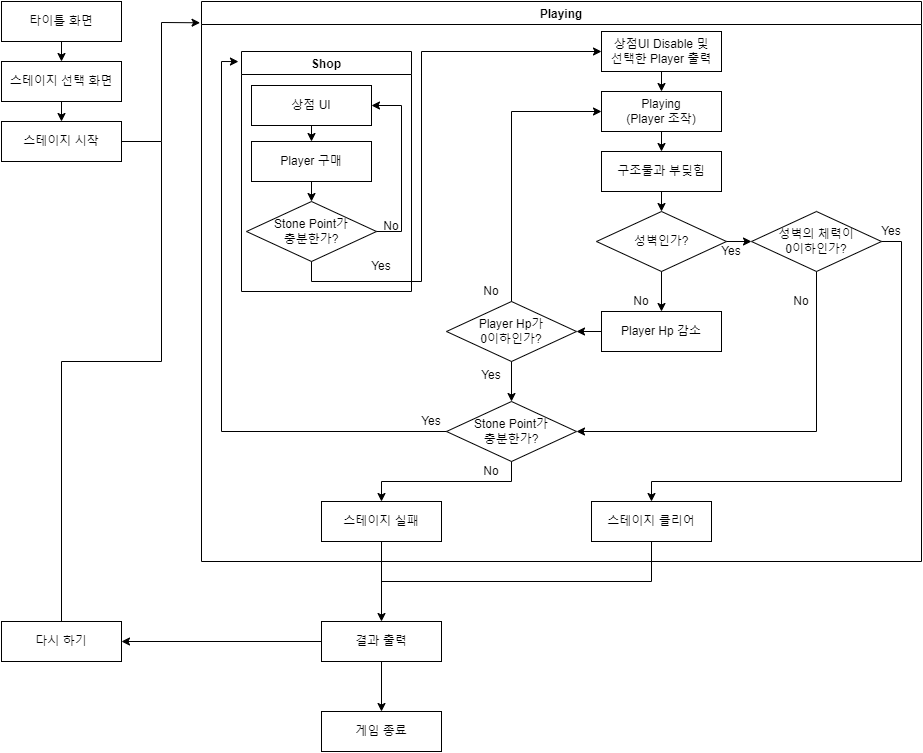

# 프로젝트명 : RollingRock(송하민)

# [ 목차 ]

## 1. [개요](#개요)
  - 게임명
  - 참여 인원 및 역할

## 2. [컨셉](#컨셉)
  - 메인 컨셉
  - 서브 컨셉

## 3. [관련 이미지 & 동영상](#이미지동영상)

## 4. [대표 이미지](#대표이미지)

## 5. [컨셉 & 대표이미지 기반 작품묘사](#작품묘사)
  - 대표이미지 기반
  - 컨셉 기반

## 6. [RollingRock : 구성 요소](#구성요소)
  - 메커니즘
  - 이야기
  - 미적요소
  - 기술

## 7. [게임 시스템 디자인](#게임시스템디자인)
  - 게임 오브젝트 분해 (구성 요소 분석)
  - 파라미터(속성) 뽑아 보기
  - 행동 뽑아 보기
  - 상태 뽑아 보기
  - 플레이어 캐릭터 속성(파라미터)
  - 게임의 규칙
  - 게임에서 사용될 공식

## 8. [FlowChart](#FlowChart)
  - 순서도
  - 키 이벤트

## 9.[요구사항(6주치)](#6주치)

## 10.[요구사항](#요구사항)

## 11. [스토리보드](#스토리보드)

  

# [개요] 

> ## 게임명

### RollingRock

- 바위가 되어 건축물의 재료로 갇혀버린 바위들을 인간들로부터 해방시킨다.

 

> ## 참여 인원 및 역할

|이름|역할|
|:---:|:---:|
|송하민|게임 기획 및 프로그래밍|
|정영범|게임 오브젝트 모델링 및 텍스쳐링, 레벨 및 맵 디자인|

  

# [컨셉] 

> ## 메인 컨셉

### 파괴

- 최종 목표인 성문이나 스테이지 내의 장애물들을 부수는 것으로 희열감을 얻을 수 있다.

> ## 서브 컨셉

### 장애물

- 스피드만 빠르게 되면 자칫 루즈해질 수 있는 게임에 장애물이라는 긴장감을 주어 플레이어로 하여금 높은 몰입감을 주기 위해 장애물을 넣는다.

### 컨트롤

- 어려운 조작 난이도를 통해 컨트롤을 세심하게 할 수 있게 한다.

### 전략

- 스테이지를 다회차 플레이하여 어떤 오브젝트를 파괴하면서 진행할지 전략을 설정할 수 있게 한다.

### 스피드

- 고저차를 통한 빠른 스피드를 통해 플레이어가 감당할 수 없는 스피드를 선사한다.

### 스테이지의 연속성

- 스테이지를 클리어하거나 리셋하기 전까지는 한 스테이지 내에서 플레이어가 플레이한 내용이 다음 플레이에도 영향을 주는 연속성을 주어 다양한 전략을 낼 수 있도록 유도한다.

  

# [관련 이미지 & 동영상] 

- ## 이미지  

  
  
   
  
- ## 동영상

  

  

# [대표 이미지] 

  

# [컨셉 & 대표이미지 기반 작품묘사] 

> ## 대표이미지 기반

- 키보드의 wasd를 통해 플레이어 조작

- 플레이어의 Hp가 0이 되거나 밖으로 떨어질 시 플레이어 사망

- 성에 도달하여 성문파괴 시 스테이지 클리어

 

> ## 컨셉 기반

- 플레이어가 바위가 되어 자연의 다른 바위들이 인간에 의해 강제적으로 건축물이 된것을 해방하는것을 목표로 합니다.

  

# [RollingRock : 구성 요소] 

> ## 메커니즘

### [도전 과제]

- 적의 성벽에 도달하여 적의 성문을 파괴

### [재미 요소]

- 여러 구조물들을 파괴하는 파괴의 희열감
- 어려운 조작 난이도를 통한 컨트롤의 재미

  

> ## 이야기

### [만들게 된 배경]  

- 바위가 구조물들을 파괴해가면서 적을 없애는 게임의 모습이 흥미로워 제작 진행
- 어려운 조작 난이도를 통해 플레이어가 고통받는 모습이 흥미로움

### [카메라 관점]  

- 플레이어를 따라다니며 3인칭으로 플레이어를 비춤
- 카메라를 움직이면 카메라가 위 아래로 움직임

  

> ## 미적요소

### [디자인]

- 배경: 바위 산 밑에 마을이 있는 모습
- 플레이어: 산에 있는 바위, 잘 굴러 떨어지기 위해 동그란 모습
- 오브젝트: 각종 석조 건축물들을 배치하여 플레이어의 이동을 제약하는 요소

### [음향]  

- 플레이어 이동 시 굴러가는 음향
- 오브젝트 파괴 시 파괴음
- 오브젝트와 충돌 시 충돌음
- 폭탄 폭파 시 폭팔음
- 자연 컨셉에 맞는 배경음악

  

> ## 기술

 - 유니티의 물리엔진을 기반으로 게임 제작

   

# [게임 시스템 디자인] 

> ## 게임 오브젝트 분해 (구성 요소 분석)

|번호|오브젝트 이름(영문이름)|이미지|
|:---:|:---:|:---:|
|1|바위(Rock)/Player||
|2|성문(Castle Gate)/승리조건||
|3|성벽(Rampart)||
|4|주민(Citizen)/적|    |
|5|나무(Tree)||
|6|가시함정(Trap)||
|7|풍차(Windmill)||
|8|폭탄(Bomb)||
|9|경사로(Slope)||
|10|벙커(Bunker)||
|11|스테이지(Select Stage)||
|12|환경설정(Setting)||
|13|메뉴(Menu)||

  

> ## 파라미터(속성) 뽑아 보기

### 1. 오브젝트 이름 : 바위

|속성|영문 명칭|설명|
|:---:|:---:|:---:|
|질량|Mass|바위의 질량, 질량이 높을수록 성문에 큰 데미지를 주고 성벽을 더 잘 부숨|
|가속|Acceleration|가속력, 플레이어가 원하는 방향으로 속도를 변환시켜주는 정도|
|최대 속력|Max Speed|플레이어가 움직이는 속도를 제한하는 속도|
|지름|Diameter|플레이어의 scale, 플레이어의 크기 조절|
|체력|Health|플레이어의 내구도, 체력이 0이 되면 플레이어가 파괴됨|
|재화|Stone Point|플레이어가 성벽을 파괴하게 되면 해당 포인트를 얻고 포인트를 이용하여 플레이어를 강화할 수 있다|

 

### 2. 오브젝트 이름 : 성문

|속성|영문 명칭|설명|
|:---:|:---:|:---:|
|체력|Health|체력이 0이되면 플레이어의 승리|

 

### 3. 오브젝트 이름 : 성벽

|속성|영문 명칭|설명|
|:---:|:---:|:---:|
|체력|Health|체력이 0이되면 플레이어에게 재화를 준다|

 

### 4. 오브젝트 이름 : 주민

|속성|영문명칭|설명|
|:---:|:---:|:---:|
|무기|Weapon|플레이어에게 무기를 던져 플레이어의 접근을 막는다|
|이동|Move|이동한다|
|정지|Stop|가만히 있는다|

 

### 5. 오브젝트 이름 : 풍차

|속성|영문명칭|설명|
|:---:|:---:|:---:|
|바람세기|Power|바람의 세기를 조절한다|
|바람모드|Mode|범위 내에 들어온 오브젝트에 가하는 AddForce의 Mode를 설정한다|

 

### 6. 오브젝트 이름 : 폭탄

|속성|영문 명칭|설명|
|:---:|:---:|:---:|
|폭발세기|Power|폭탄이 터지면 얼마나 멀리 날아가는지 조절|
|폭발피해량|Damage|플레이어에게 데미지를 준다|

  

> ## 행동 뽑아 보기

### 1. 오브젝트 이름 : 바위

|행동|영문 명칭|설명|
|:---:|:---:|:---:|
|이동|Move|플레이어를 이동시킨다|
|점프|Jump|위로 튀어오른다|

 

### 2. 오브젝트 이름 : 주민

|행동|영문 명칭|설명|
|:---:|:---:|:---:|
|이동|Move|좌우로 이동한다|
|바위에 깔림|Crush|바위에 깔려 납작해진다|
|공격|Attack|바위를 공격한다|

  

> ## 상태 뽑아 보기

### 1. 오브젝트 이름 : 바위

|현상태|전이상태|전이조건|
|:---:|:---:|:---:|
|이동|점프|점프키를 누름|

 

### 2. 오브젝트 이름 : 주민

|현상태|전이상태|전이조건|
|:---:|:---:|:---:|
|이동|바위에 깔림|플레이어에게 부딪혀 깔린 상태|
|이동|공격|플레이어가 일정 범위 내에 들어오면 공격|

  

> ## 플레이어 캐릭터 속성(파라미터)

|속성|영문 명칭|설명|
|:---:|:---:|:---:|
|이동속도|Speed|플레이어 이동 속도|
|최대속도|MaxSpeed|최대 이동 속도|
|점프력|Jump|위로 튀어 오르는 힘|

  

> ## 게임의 규칙

### 핵심 규칙
1. 게임 시작 시 Fade In이 되고 바위의 모습 출력
2. 오브젝트를 조작하여 구조물 파괴
3. 성문 파괴 시 게임 승리 후 다음 스테이지 해금

 

### 보조 규칙
- 구조물 파괴 시 스테이지 초기화 전까지 파괴된 상태

  

> ## 게임에서 사용될 공식

### 플레이어, 구조물 충돌 공식
1. 플레이어, 구조물 충돌 시 플레이어의 velocity와 구조물이 충격을 직접적으로 받는 Normal벡터를 Dot Product하여 충격량 계산
2. 계산된 충격량을 통해 구조물의 HP 감소 후 0이하가 되면 구조물 파괴
3. 해당 충격량이 플레이어에게도 전달

 

### 폭발물의 폭발력, 데미지 공식
1. 폭발물에 접촉 시 폭파
2. 폭발물 주변 폭발 범위에 플레이어, 성벽과 같은 구조물이 있다면 폭발물-오브젝트 거리를 폭발물의 최대 폭발 거리를 나눔
3. 계산된 결과를 폭발력, 데미지에 곱하여 해당 폭발력과 데미지를 주변에 전달

 

### 풍차 공식
1. 풍차로부터 오브젝트가 떨어진 거리 계산
2. 떨어진 거리를 풍차의 영향력이 닿는 최대 거리로 나눔
3. 계산된 결과를 풍차의 바람힘에 곱하여 전달

  

# [FlowChat]

## 순서도

 

## 키 이벤트

  

# [요구사항(6주치)] 
> ## 프로그래밍

### 게임시스템
- ~~fade in/out 효과~~
- ~~플레이어가 적의 성문을 부수면 게임 클리어~~
- ~~적의 구조물을 파괴한다면 파괴하면서 지나가며 파괴하지 못하면 막힘~~

### 플레이어
- ~~wasd를 눌러서 바위를 움직임~~
- ~~점프 버튼을 누르면 바위가 뛰어오름~~
- ~~카메라가 플레이어의 뒤에서 플레이어를 따라다니며 플레이어를 보여줌~~
- ~~마우스의 움직임으로 카메라를 제어할 수 있음~~

### 오브젝트
- ~~적의 구조물 파괴 시 구조물 조각내기~~
- ~~파괴된 구조물 조각 사라지게 하기~~
- ~~폭탄 접촉 시 폭탄 파괴 및 폭발 생성~~

### UI
- ~~스테이지 클리어 출력~~
- ~~설정창 제작~~
- ~~화면 비율 조정~~

 

> ## 디자인

### 모델링 제작
- ~~바위/플레이어~~
- ~~성벽~~
- ~~성문~~
- ~~주민/적~~
- ~~나무~~
- ~~가시함정~~
- ~~풍차~~
- ~~폭탄~~
- ~~맵~~

### 기본 텍스쳐 제작
- ~~바위/플레이어~~
- ~~성벽~~
- ~~성문~~
- ~~주민/적~~
- ~~나무~~
- ~~가시함정~~
- ~~풍차~~
- ~~폭탄~~
- ~~맵~~

### 스테이지 제작 및 레벨링
- ~~1스테이지~~

# [요구사항] 
> ## 프로그래밍

### 게임시스템
- ~~fade in/out 효과~~
- ~~플레이어가 적의 성문을 부수면 게임 클리어~~
- ~~적의 구조물을 파괴한다면 파괴하면서 지나가며 파괴하지 못하면 막힘~~
- ~~플레이어의 HP가 0이 되면 초기위치로 돌아감~~
- ~~플레이어가 스테이지 이탈 시 초기위치로 돌아감~~
- ~~스테이지 클리어시 해금~~
- ~~게임 진행사항 저장~~

### 플레이어
- ~~wasd를 눌러서 바위를 움직임~~
- ~~점프 버튼을 누르면 바위가 뛰어오름~~
- ~~카메라가 플레이어의 뒤에서 플레이어를 따라다니며 플레이어를 보여줌~~
- ~~마우스의 움직임으로 카메라를 제어할 수 있음~~

### 오브젝트
- ~~적의 구조물 파괴 시 구조물 조각내기~~
- ~~파괴된 구조물 조각 사라지게 하기~~
- ~~폭탄 접촉 시 폭탄 파괴 및 폭발 생성~~
- ~~구조물 파괴 시 파괴 효과(파티클)생성~~
- ~~풍차의 바람영역에 있으면 바람에 밀림~~
- ~~가시함정 접촉 시 플레이어 데미지 입음~~

### UI
- ~~스테이지 클리어 출력~~
- ~~게임 타이틀 화면 제작~~
- ~~설정창 제작~~
- ~~사운드, 마우스 민감도 설정 및 저장~~
- ~~화면 비율 조정~~
- ~~스테이지 선택~~

 

> ## 디자인

### 모델링 제작
- ~~바위/플레이어~~
- ~~성벽~~
- ~~성문~~
- ~~주민/적~~
- ~~나무~~
- ~~가시함정~~
- ~~풍차~~
- ~~폭탄~~
- ~~맵~~

### 기본 텍스쳐 제작
- ~~바위/플레이어~~
- ~~성벽~~
- ~~성문~~
- ~~주민/적~~
- ~~나무~~
- ~~가시함정~~
- ~~풍차~~
- ~~폭탄~~
- ~~맵~~

### 텍스쳐 제작
- 바위/플레이어
- 성벽
- 성문
- 주민/적
- 나무
- 가시함정
- 풍차
- 폭탄
- 맵

### 모델링 바리에이션 제작
- 스테이지 컨셉에 따른 텍스쳐 바리에이션
- 건물 의 세부 장식 제작

### 스테이지 제작 및 레벨링

### UI 제작
 - 메인 메뉴 버튼
 - 상점 버튼 이미지
 - 조이스틱
 - 환경설정 이미지
 - 타이틀 화면
 - 스테이지 선택 화면
 - 승리/패배 화면
 - 포인트 이미지
 - 드래그 바

  

# 스토리보드

